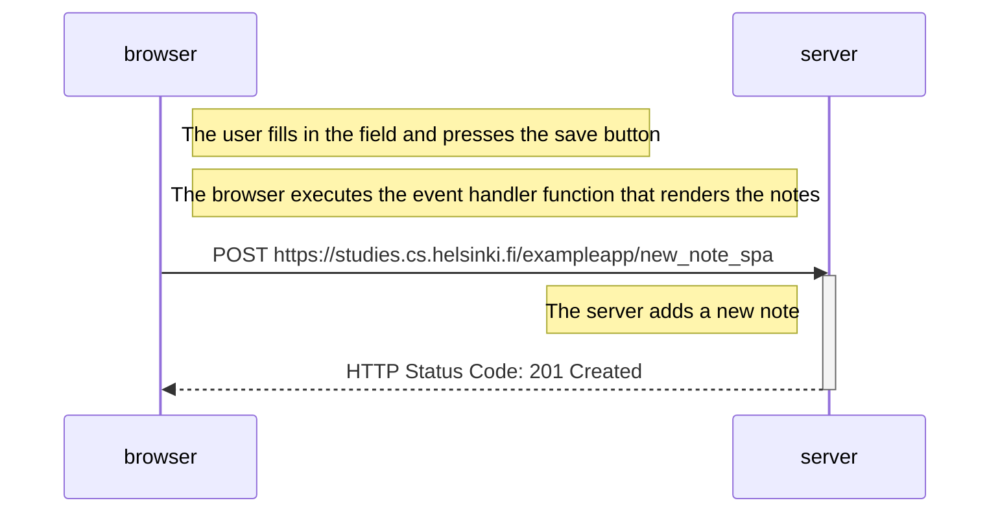

```mermaid

sequenceDiagram
    participant browser
    participant server

    Note right of browser: The user fills in the field and presses the save button
    Note right of browser: The browser executes the event handler function that renders the notes

    browser->>server: POST https://studies.cs.helsinki.fi/exampleapp/new_note_spa
    activate server
    Note left of server: The server adds a new note
    server-->>browser: HTTP Status Code: 201 Created
    deactivate server

```
